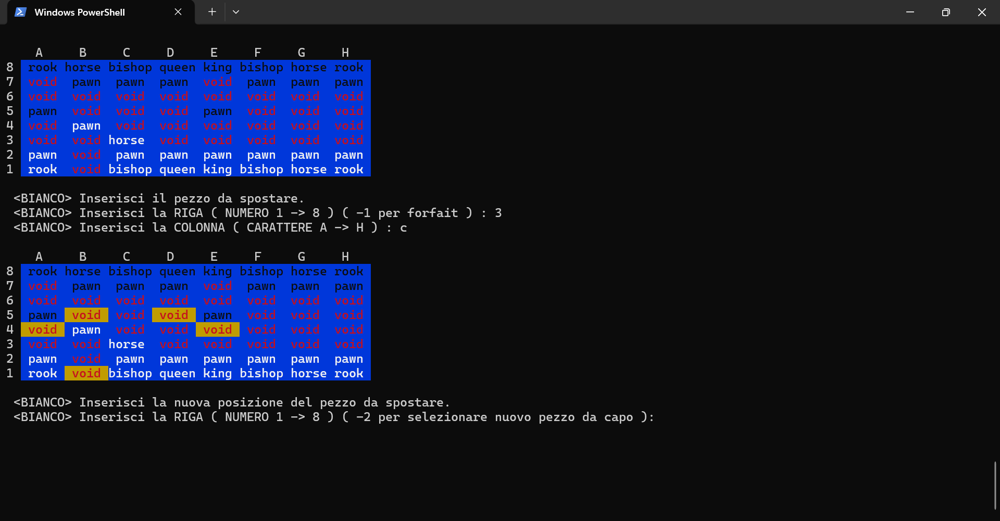

CHESS PROJECT

This repository contain my personal version of the game Chess. 
I implemented all and only the Official chess rules (en passant and castling included). There is no time constraint nor anyway to apply a time constraint.
This version is playable only on terminal. 
(some terminal may not support the colored texts... I have no idea how to fix it, i advice to change the code where i implement the color.hpp library -> all printing functions)





```bash 
  _   _                        __ ___                     _      
 | | | |                      / /|__ \                   | |     
 | |_| |__   __ _ _ __ _   _ / /_   ) |      ___ ___   __| | ___ 
 | __| '_ \ / _` | '__| | | | '_ \ / /      / __/ _ \ / _` |/ _ \
 | |_| | | | (_| | |  | |_| | (_) / /_     | (_| (_) | (_| |  __/
  \__|_| |_|\__,_|_|   \__,_|\___/____|     \___\___/ \__,_|\___|
```     
